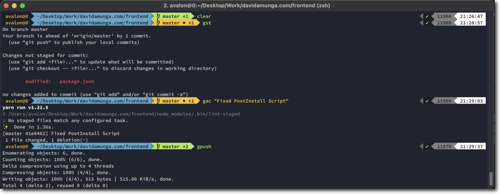

<h1 align="center">Talos Dark Theme for iTerm2</h1>

This is an iTerm2 color scheme based on <a href="https://marketplace.visualstudio.com/items?itemName=damunga.talos-dark">Talos Dark Theme for VSCode</a> 

### Screenshots
---

## How to use it
1. Clone the Repo or Download the `talos-dark.itermcolors` file
2. `iTerm2` > `Preferences` > `Profiles`
3. Select the `Default` Profile or Create your Own.
4. Under the `Colors` Tab select at the bottom `Color Presets` then `Import`
5. Import the `talos-dark.itemcolors` file

## Setup from Screenshot
- ZSH Theme - [Powerlevel9K for ZSH](https://github.com/Powerlevel9k/powerlevel9k)
- Font - 12pt Source Code Pro Semibold for Powerline
 
 
 